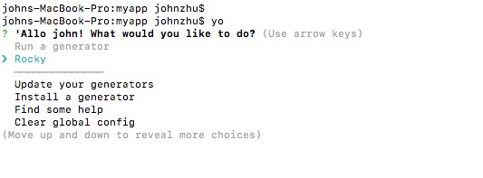
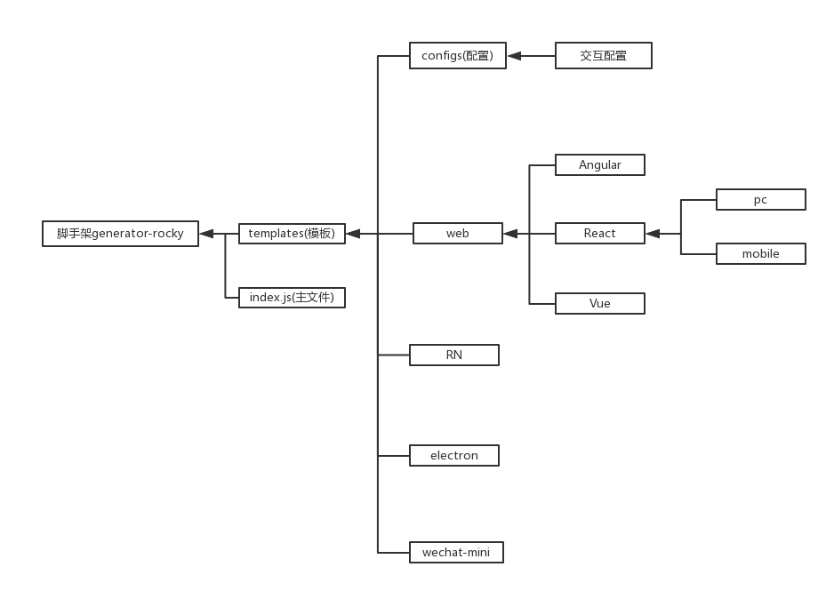
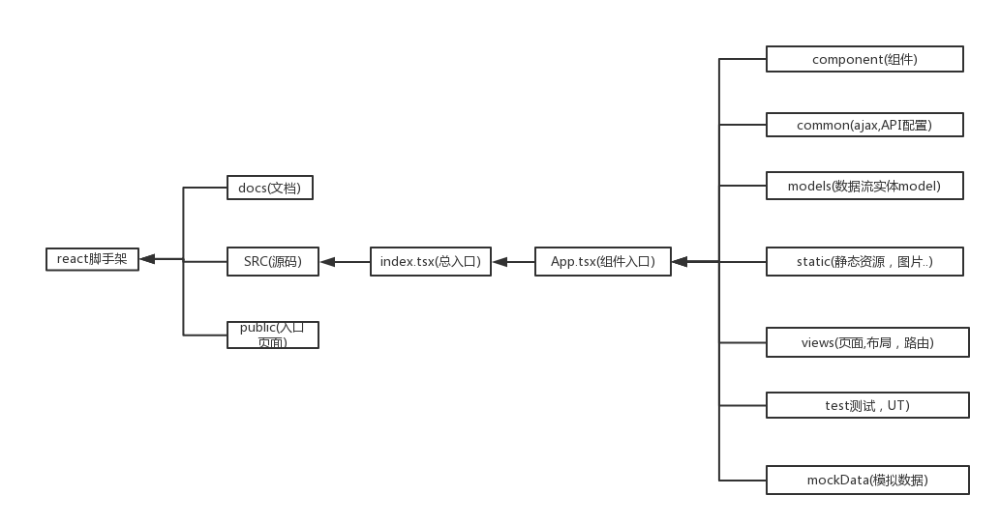

# yeoman-gens

<!-- @import "[TOC]" {cmd="toc" depthFrom=1 depthTo=6 orderedList=false} -->

<!-- code_chunk_output -->

* [yeoman-gens](#yeoman-gens)
	* [1.项目介绍](#1项目介绍)
		* [1.1 如何使用](#11-如何使用)
		* [1.2 什么是yeoman](#12-什么是yeoman)
		* [1.3 yeman项目架构](#13-yeman项目架构)
	* [2. react-pc 项目](#2-react-pc-项目)
		* [2.1 架构图](#21-架构图)
		* [2.2 技术选型](#22-技术选型)
	* [3. react-mobile 项目](#3-react-mobile-项目)
	* [4. vue-pc 项目](#4-vue-pc-项目)

<!-- /code_chunk_output -->

## 1.项目介绍

使用yeoman生成的一个脚手架工具，包含一些基础web项目的搭建和模板。

### 1.1 如何使用

```shell
git clone https://github.com/johnzhu12/yeoman-gens.git
cd yeoman-gens/generator-rocky
npm link
```

然后只要想创建一个项目，比如myapp:

```shell
 mkdir myapp
 cd myapp
 yo
```

就会如下图所示的指引，根据指引一步步创建你的项目脚手架


### 1.2 什么是yeoman

[yeoman介绍](http://yeoman.io)
yeoman是一个脚手架工具，可以设计丰富的交互来创建新的项目，提高效率。

### 1.3 yeman项目架构



## 2. react-pc 项目

### 2.1 架构图



### 2.2 技术选型

typescript,antd,mobx,styled-component。

## 3. react-mobile 项目

## 4. vue-pc 项目
