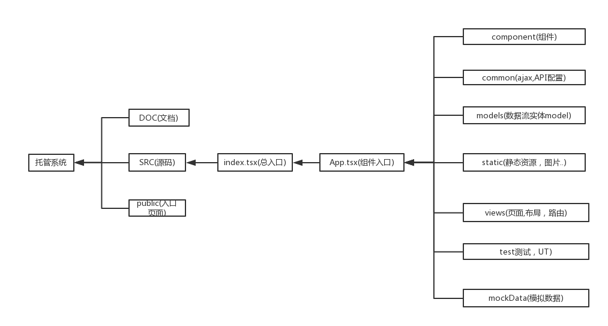

# 系统设计文档

<!-- @import "[TOC]" {cmd="toc" depthFrom=1 depthTo=6 orderedList=false} -->

<!-- code_chunk_output -->

* [系统设计文档](#系统设计文档)
	* [1. 前端技术选型](#1-前端技术选型)
		* [1.1 前端UI框架:react](#11-前端ui框架react)
		* [1.2 数据流工具:mobx](#12-数据流工具mobx)
		* [1.3 组件库:antd](#13-组件库antd)
		* [1.4 静态类型语言:typescript](#14-静态类型语言typescript)
		* [1.5 ajax库:axios](#15-ajax库axios)
		* [1.6 css:styled-component](#16-cssstyled-component)
	* [2. 前端架构设计](#2-前端架构设计)
		* [2.1 系统架构图](#21-系统架构图)

<!-- /code_chunk_output -->

## 1. 前端技术选型

### 1.1 前端UI框架:react

 React 是一个用于构建用户界面的 JAVASCRIPT 库。
React主要用于构建UI，很多人认为 React 是 MVC 中的 V（视图）。
React 起源于 Facebook 的内部项目，用来架设 Instagram 的网站，并于 2013 年 5 月开源。
React 拥有较高的性能，代码逻辑非常简单，越来越多的人已开始关注和使用它。

### 1.2 数据流工具:mobx

Mobx是一个功能强大，上手非常容易的状态管理工具。就连redux的作者也曾经向大家推荐过它，在不少情况下你的确可以使用Mobx来替代掉redux。

### 1.3 组件库:antd

ant design是阿里设计的组件库，一个服务于企业级产品的设计体系，基于『确定』和『自然』的设计价值观和模块化的解决方案，让设计者专注于更好的用户体验。目前有react和angular版本，包括mobile端的ant-design-mobile

### 1.4 静态类型语言:typescript

TypeScript是一种由微软开发的自由和开源的编程语言。它是JavaScript的一个超集，而且本质上向这个语言添加了可选的静态类型和基于类的面向对象编程。

### 1.5 ajax库:axios

 axios 是一个基于Promise 用于浏览器和 nodejs 的 HTTP 客户端
### 1.6 css:styled-component

styled-component是react样式化组件,为css带来了模块化。

## 2. 前端架构设计

### 2.1 系统架构图
